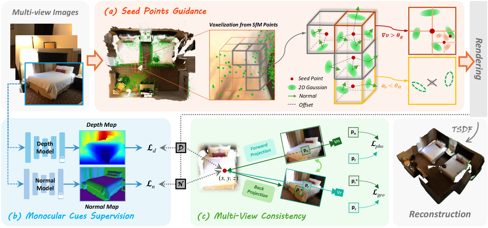

<div align="center">

  <h1 align="center">2DGS-Room: Seed-Guided 2D Gaussian Splatting with Geometric Constrains for High-Fidelity Indoor Scene Reconstruction</h1>
<!--   <h2 align="center">ICML 2024</h2> -->
  


[Wanting Zhang](https://scholar.google.com/citations?user=V6mBA5IAAAAJ), [Haodong Xiang](https://github.com/Valentina-Zhang), [Zhichao Liao](https://scholar.google.com.hk/citations?user=4eRwbOEAAAAJ&hl=zh-CN), [Xinghui Li](https://github.com/Crayon-Shinchan)✉, [Long Zeng](https://www.sigs.tsinghua.edu.cn/cl/main.htm) <br />


### [[`Project Page`](https://Valentina-Zhang.github.io/2DGS-Room/)][[`arxiv`](https://arxiv.org/abs/2405.19671)][[`Paper`](https://arxiv.org/pdf/2405.19671)]
</div>


## 📃 Abstract
The reconstruction of indoor scenes remains challenging due to the inherent complexity of spatial structures and the prevalence of textureless regions. 
Recent advancements in 3D Gaussian Splatting have improved novel view synthesis with accelerated processing but have yet to deliver comparable performance in surface reconstruction. 
In this paper, we introduce <b>2DGS-Room</b>, a novel method leveraging 2D Gaussian Splatting for high-fidelity indoor scene reconstruction. 
Specifically, we employ a seed-guided mechanism to control the distribution of 2D Gaussians, with the density of seed points dynamically optimized through adaptive growth and pruning mechanisms. 
To further improve geometric accuracy, we incorporate monocular depth and normal priors to provide constraints for details and textureless regions respectively. 
Additionally, multi-view consistency constraints are employed to mitigate artifacts and further enhance reconstruction quality. 
Extensive experiments on ScanNet and ScanNet++ datasets demonstrate that our method achieves state-of-the-art performance in indoor scene reconstruction.

## 🧭 Overview
<p align="center">

</p>

Given multi-view posed images, we improve 2DGS to achieve high-fidelity geometric reconstruction for indoor scenes.
(a) Starting from an SfM-derived point cloud, we generate a set of seed points through voxelization, establishing a stable foundation for guiding the distribution and density of 2D Gaussians. 
We further introduce an adaptive growth and pruning strategy to optimize seed points. 
(b) We incorporate depth and normal priors, addressing the challenges of detailed areas and textureless regions. 
(c) We introduce multi-view consistency constraints to further enhance the quality of the indoor scene reconstruction.


## 🌏 Our code is coming soon.
<!-- Thank you all for your attention. I have been busy with my internship and the autumn recruitment recently. I expect to have some free time in October, and at the latest, I will make it open source in November. -->


    
## 🖊 Citation
If you find this project useful in your research, please consider cite:

```
@article{zhang20242DGS-Room,
  title={2DGS-Room: Seed-Guided 2D Gaussian Splatting with Geometric Constrains for High-Fidelity Indoor Scene Reconstruction},
  author={Xiang, Haodong and Li, Xinghui and Lai, Xiansong and Zhang, Wanting and Liao, Zhichao and Cheng, Kai and Liu, Xueping},
  journal={arXiv preprint arXiv:2405.19671},
  year={2024}
}
```

<!-- # Website License
<a rel="license" href="http://creativecommons.org/licenses/by-sa/4.0/"></a><br />This work is licensed under a <a rel="license" href="http://creativecommons.org/licenses/by-sa/4.0/">Creative Commons Attribution-ShareAlike 4.0 International License</a>. -->
